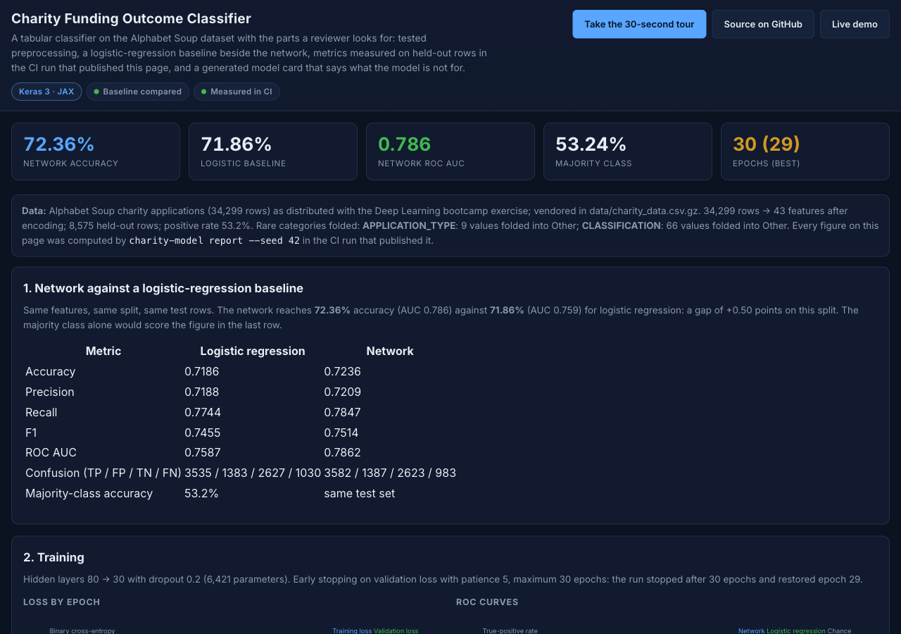
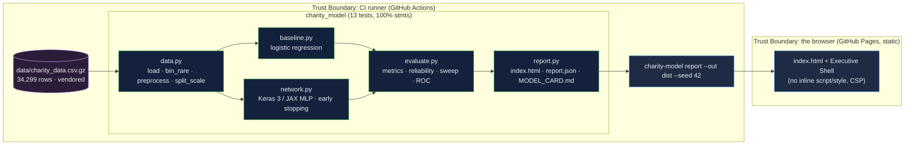

# DeepLearning-Charity: a tabular classifier with a baseline beside it, metrics measured in CI, and a model card that says what it is not for

[](https://github.com/Freddricklogan/DeepLearning-Charity/actions/workflows/deploy.yml)
[](#5-getting-started--verification)
[](https://github.com/Freddricklogan/DeepLearning-Charity/actions/workflows/codeql.yml)
[](LICENSE)
[](https://freddricklogan.github.io/DeepLearning-Charity/)

## 1. Executive Summary & Business Impact

**Problem statement.** The Alphabet Soup charity exercise asks whether
a neural network can predict which funded applicants will use the money
effectively. The previous version of this repository was a 600-line
monolith with a grid search that recorded nothing, a README promising
"maximum performance" and "production-ready deployment" with no number
behind either, a scaler fitted before the split, and a dataset that was
not in the repository (`AUDIT.md`).

**Solution & value delivered.** An installable package that vendors
the 34,299-row dataset, validates its schema, bins rare categories
with explicit thresholds, log-transforms the heavy-tailed ask amount,
fits its scaler on training rows only, trains a logistic-regression
baseline and a Keras 3 network side by side, measures accuracy,
precision, recall, F1, ROC AUC, calibration and a threshold sweep on
held-out rows, and writes a static report and a model card — all in
the CI run that publishes them. On seed 42 the network reaches 72.36 %
accuracy (AUC 0.786) against 71.86 % (AUC 0.759) for the baseline; the
card says to treat a gap that size as noise unless it repeats.

**[→ Read the full case study](docs/CASE_STUDY.md)** · [Model card](docs/MODEL_CARD.md)



## 2. Demonstrated Competencies & Technical Skills

- **Machine Learning & Evaluation** — baseline comparison, stratified
  split without leakage, early stopping with restored weights,
  calibration and operating-point analysis, model card with stated
  limits.
- **Data Engineering** — schema validation, explicit rare-category
  binning, log transform, one-hot encoding with named features, seeded
  reproducibility across the pipeline.
- **MLOps** — typed package with a CLI, report built and published by
  CI, Dockerfile, Streamlit companion, ruff / mypy strict / bandit /
  pip-audit / Trivy gates.
- **Honesty about results** — every number on the page and in the card
  is produced by the run that published it; the old unmeasured claims
  are catalogued in `AUDIT.md`.

## 3. System Architecture & Data Flow



The browser receives a finished report; no model runs client-side and
nothing is fetched at view time.

## 4. Technical Highlights & Engineering Decisions

### ADR-1 — A baseline on identical features and split

**Context.** The old repository trained only a network and reported no
number; a network alone cannot show it learned anything a linear model
would not.

**Decision.** `baseline.py` fits L2 logistic regression on the same
encoded features and the same stratified split; the report and card
print both models' metrics in one table with the majority-class rate.

**Consequence.** The measured gap on seed 42 is +0.50 accuracy points
and +0.028 AUC. The card states that the accuracy difference is within
run-to-run variation unless repeated across seeds.

### ADR-2 — Preprocessing as tested pure functions

**Context.** Binning thresholds were inline constants; the scaler was
fitted on all rows; the ask amount spanned six orders of magnitude.

**Decision.** `bin_rare` takes an explicit threshold and returns the
folded values; `preprocess` records them; `split_scale` fits the scaler
on training rows only and exposes its statistics; `ASK_AMT` is
`log1p`-transformed.

**Consequence.** Tests pin the classic result (nine application types
after binning), the no-leakage property, and the transformed range.

### ADR-3 — Keras 3 on the JAX backend, early stopping, one seed

**Context.** A 6,421-parameter model does not need TensorFlow, and a
grid search that records nothing is not tuning.

**Decision.** One stated configuration (80 → 30, dropout 0.2, Adam
1e-3, batch 256) trained up to 30 epochs with patience 5 and best
weights restored; the seed drives the split, the baseline and the
network.

**Consequence.** The full report builds in about five seconds locally;
a test trains twice with the same seed and asserts identical
probabilities.

## 5. Getting Started & Verification

**Prerequisites.** Python 3.12 and `uv`.

```bash
git clone https://github.com/Freddricklogan/DeepLearning-Charity.git
cd DeepLearning-Charity
uv venv && uv pip install -e ".[dev]"
make check                                   # lint, typecheck, test, security, build
uv run charity-model report --out dist --seed 42   # writes dist/index.html, report.json, MODEL_CARD.md
uv run --extra app streamlit run streamlit_app.py  # interactive threshold explorer
docker build -t charity-model . && docker run --rm -v "$PWD/dist:/app/dist" charity-model
```

**Verification — the numbers this repository actually produced (seed 42):**

| Check | Result |
| --- | --- |
| Tests (pytest) | **13 passed / 13** |
| Coverage | **100%** statements over `charity_model` (CLI excluded) |
| ruff, ruff format, mypy --strict | clean |
| bandit, pip-audit | 0 findings; no known vulnerabilities |
| Data | 34,299 rows → 43 features; 8,575 held-out rows; positive rate 53.24 % |
| Logistic regression | accuracy 0.7186 · precision 0.7188 · recall 0.7744 · F1 0.7455 · AUC 0.7587 |
| Network (80 → 30, 6,421 params) | accuracy 0.7236 · precision 0.7209 · recall 0.7847 · F1 0.7514 · AUC 0.7862; 30 epochs, best 29 |
| Report smoke (headless Chrome) | **0 console errors**; KPI strip, 3 tables, 2 SVG charts, 4 tour steps; no horizontal scroll at 1280 or 400 px |

The CI run that publishes the page recomputes every figure; if they
drift from this table, the page is right and the table is stale.

## 6. Live Demo & Production Showcase

**<https://freddricklogan.github.io/DeepLearning-Charity/>** — the
report the CI pipeline built, with the model card at
[`MODEL_CARD.md`](https://freddricklogan.github.io/DeepLearning-Charity/MODEL_CARD.md)
and the raw numbers in `report.json`.

**30-second guided walkthrough.** Press **Take the 30-second tour** on
the report: what the run was, why the baseline matters, the early
stopping curve, and calibration.
